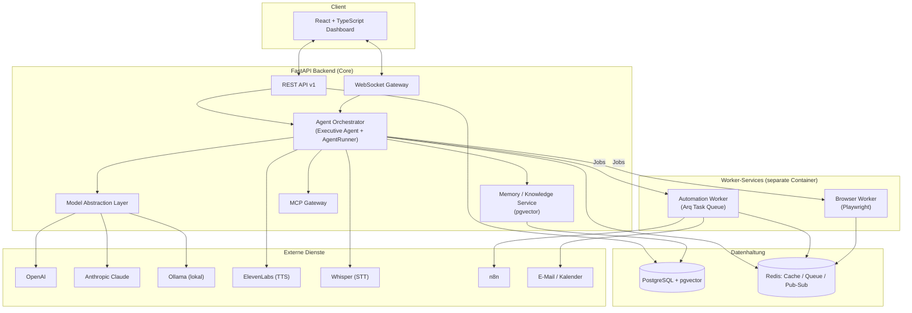
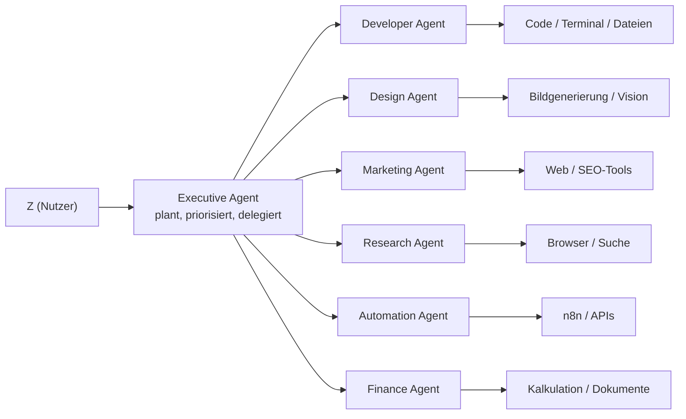

# FUTURIST OS — Systemarchitektur & Entwicklungsplan

**Status:** Entwurf — wartet auf Freigabe. Es wurde noch kein Anwendungscode geschrieben.
**Scope dieses Dokuments:** (1) Systemarchitektur, (2) Ordnerstruktur, (3) Datenbankstruktur, (4) API-Design, (5) Agentenarchitektur, (6) Entwicklungsplan mit Meilensteinen.

---

## 0. Vorbemerkung: Annahmen, die ich getroffen habe

Bevor ich Entscheidungen begründe, hier die Annahmen, auf denen die gesamte Architektur aufbaut. Wenn eine davon falsch ist, ändert sich der Plan spürbar — bitte gegenlesen:

1. **Single-User zu Beginn, Multi-User-fähig von Anfang an.** Du bist der einzige Nutzer, aber `users`/`roles` werden von Tag 1 an so modelliert, dass später Teammitglieder oder Kunden hinzugefügt werden können, ohne das Schema neu zu schreiben.
2. **Self-Hosting zuerst** (Docker Compose, auf deiner eigenen Infrastruktur), Cloud-Deployment (z. B. Hetzner/AWS) als späterer Schritt, nicht Tag-1-Anforderung.
3. **Modell-IDs sind Konfiguration, kein Code.** Konkrete Modellbezeichner (z. B. welche GPT- oder Claude-Version, welches Ollama-Modell) werden zentral in `model_configs` gepflegt und sind jederzeit ohne Deployment änderbar — ich nagle keine spezifische Modellversion im Code fest.
4. **Iterative Lieferung, kein Big-Bang.** Der Entwicklungsplan liefert nach jeder Phase ein lauffähiges System, nicht erst am Ende.
5. Zeitschätzungen im Entwicklungsplan sind **grobe Richtwerte** (Wochen, keine Deadlines) unter der Annahme fokussierter Einzel-/Kleinteam-Entwicklung — bitte anpassen, sobald reale Kapazität feststeht.

---

## 1. Systemarchitektur

### 1.1 Architekturstil

**Entscheidung: Modularer Monolith mit ausgelagerten Worker-Services**, kein volles Microservice-Mesh.

| Option | Vorteile | Nachteile |
|---|---|---|
| **Voller Monolith** (ein Prozess) | Einfachstes Deployment, keine Netzwerklatenz zwischen Modulen | Playwright/Terminal-Last beeinträchtigt die API; schwer unabhängig zu skalieren |
| **Volle Microservices** (ein Service pro Agent/Feature) | Maximale Skalierbarkeit/Isolation | Für ein Ein-Personen-/Kleinteam-Projekt massiver Overhead (Service-Discovery, verteiltes Tracing, N Dockerfiles) — widerspricht "sauber strukturiert" |
| **Modularer Monolith + 2 Worker-Services** (empfohlen) | Ein FastAPI-Codebase mit klaren internen Modulgrenzen (`agents/`, `memory/`, `integrations/`); nur die zwei wirklich ressourcenintensiven/instabilen Teile (Browser-Automatisierung, Terminal/Automations-Jobs) laufen als eigene Container | Etwas mehr Infra als reiner Monolith, aber deutlich weniger als volle Microservices |

**Begründung:** Playwright-Browserinstanzen und Terminal-Sessions sind die einzigen Teile, die (a) viel Ressourcen brauchen, (b) abstürzen können, (c) unabhängig skalieren sollten. Alles andere (Chat, Projekte, Wissensdatenbank, restliche Agenten-Logik) profitiert von einem einzigen Codebase ohne Netzwerk-Overhead.

### 1.2 High-Level-Diagramm



### 1.3 Kernentscheidungen mit Alternativen

#### a) Agenten-Orchestrierung

| Option | Vorteile | Nachteile |
|---|---|---|
| **LangGraph** | Graph-basierte State-Machine, eingebautes Checkpointing, großes Ökosystem | Zusätzliche Abstraktionsschicht über den Modell-APIs; schnelllebiges Framework, Breaking Changes; erschwert volle Transparenz |
| **CrewAI / AutoGen** | Schnelles Prototyping mit rollenbasierten "Crews" | Weniger Kontrolle über Kontrollfluss, für produktives Kernsystem historisch weniger gehärtet |
| **Custom, schlanker Orchestrator** (empfohlen) | Volle Transparenz und Kontrolle, direkt auf den nativen Tool-/Function-Calling-APIs der Provider, keine fremde Breaking-Change-Historie, passt zu "sauber strukturierter Code" | Mehr Initialaufwand (State-Handling, Streaming, Tool-Registry selbst bauen) |

**Empfehlung:** Eigener, schlanker **AgentRunner** (Konversationsschleife + Tool-Registry + State-Persistenz in Postgres) statt eines schweren Frameworks. Da FUTURIST OS ein langfristiges Kernsystem ist, das du selbst verstehen und erweitern sollst, überwiegt Transparenz gegenüber Entwicklungsgeschwindigkeit. Sollte die Planungslogik des Executive Agent später sehr komplexe Verzweigungen brauchen, ist ein Umstieg auf LangGraph *für dieses eine Modul* jederzeit nachrüstbar, ohne den Rest anzufassen.

#### b) Vektorspeicher für Wissensdatenbank & Langzeitgedächtnis

| Option | Vorteile | Nachteile |
|---|---|---|
| **pgvector** (in PostgreSQL) (empfohlen) | Keine zusätzliche Infrastruktur, transaktionale Konsistenz mit relationalen Daten (Projekte, Notizen), ein Backup-Ziel, einfaches lokales Setup | Skaliert schlechter als dedizierte Vektor-DBs jenseits mehrerer Millionen Embeddings |
| **Qdrant / Weaviate / Milvus** | Bessere Performance bei sehr großem Datenvolumen, erweiterte Hybrid-Search-Features | Weiterer Service zu betreiben/sichern/überwachen |

**Empfehlung:** Start mit **pgvector**. Für eine persönliche/unternehmensinterne Wissensdatenbank wird die Millionen-Grenze auf absehbare Zeit nicht erreicht. Migration zu Qdrant ist ein sauberer späterer Schritt (Embeddings + Metadaten sind bereits relational vorhanden) — kein Day-1-Bedarf.

#### c) Task-Queue für Agent-Läufe & Automatisierungen

| Option | Vorteile | Nachteile |
|---|---|---|
| Celery + Redis | Reif, riesiges Ökosystem | Schwergewichtig, nicht asyncio-nativ, mehr Konfigurationsaufwand |
| FastAPI `BackgroundTasks` | Kein zusätzlicher Service | Kein Retry, keine Persistenz, keine Zeitplanung — ungeeignet für lange Agent-Läufe |
| **Arq** (empfohlen) | Asyncio-nativ (passt zu FastAPI + async Modell-Calls), nutzt das ohnehin vorhandene Redis, schlank | Kleineres Ökosystem als Celery |

**Empfehlung:** **Arq**, da asyncio-nativ und ohne zusätzliche Infrastruktur (nutzt Redis, das wir für Cache/Pub-Sub sowieso brauchen). Celery bleibt Fallback, falls später Windows-Worker oder komplexe Scheduling-Patterns nötig werden.

#### d) Echtzeit-Kommunikation

**Empfehlung:** **WebSockets** als primärer Transport für Chat-Streaming, Agent-Status, Terminal-I/O und Browser-Events (ein Envelope-Format mit `type`-Feld, mehrere Kanäle über einen Socket), gestützt durch **Redis Pub/Sub** als Backplane, damit mehrere Backend-Replicas denselben Nutzer bedienen können. REST für alles, was kein Stream ist (CRUD, Settings). SSE wurde verworfen, weil Terminal- und Browser-Steuerung bidirektional sein müssen (Befehle *und* Ausgabe über denselben Kanal).

#### e) Browser-Automatisierung: gleicher Prozess vs. eigener Service

**Empfehlung:** Eigener **Browser-Worker**-Container von Anfang an. Chromium-Instanzen sind ressourcenintensiv und potenziell instabil — das darf die Haupt-API nicht mit runterreißen. Der Worker konsumiert Jobs aus der Arq-Queue und meldet Ergebnisse/Screenshots über Redis Pub/Sub zurück an die WebSocket-Gateway.

#### f) Verschlüsselung von API-Keys

**Empfehlung:** **Fernet-Envelope-Verschlüsselung** (Paket `cryptography`), Master-Key aus Umgebungsvariable/Docker-Secret, verschlüsselter Wert in Postgres. Für ein selbst gehostetes persönliches System ist ein volles KMS/Vault-Setup unverhältnismäßiger Overhead — Migrationspfad dorthin wird dokumentiert, falls FUTURIST OS später mandantenfähig/kommerziell wird.

#### g) Frontend State Management & UI-Bibliothek

**Empfehlung:** **TanStack Query** für Server-State (alles, was von der API kommt) + **Zustand** für reinen UI/Client-State (Sidebar, aktiver Chat-Entwurf, WS-Verbindungsstatus) statt Redux Toolkit (weniger Boilerplate, passt zu einem datenlastigen Dashboard). UI-Basis: **shadcn/ui + Tailwind CSS** statt MUI/Ant/Chakra — damit das eigene Schwarz/Anthrazit/Silber-Theme nicht gegen ein fremdes Theming-System kämpft, und Komponenten im Repo liegen (leicht erweiterbar). Animationen über **Framer Motion**.

### 1.4 Sicherheitsarchitektur

- **Auth:** JWT Access-Token (kurzlebig) + Refresh-Token (in `sessions`-Tabelle, revozierbar), Passwort-Hashing mit `argon2`.
- **RBAC:** `roles`-Tabelle (`admin`, `member`, perspektivisch `client`), Rechte pro Ressourcentyp.
- **Secrets:** Fernet-verschlüsselt at rest (siehe 1.3f), niemals im Klartext geloggt oder an das Frontend zurückgegeben.
- **Audit-Logging:** jede schreibende Aktion eines Agenten (Datei geändert, E-Mail gesendet, Automatisierung ausgelöst) landet in `audit_logs` — nachvollziehbar, wer/was/wann.
- **Sandboxing:** Terminal- und Browser-Sessions laufen mit eingeschränkten Rechten im jeweiligen Worker-Container (kein Zugriff auf Host-Dateisystem außerhalb definierter Volumes).
- **Backups:** nächtlicher `pg_dump` + Redis-Snapshot in `infra/scripts/backup.sh`, Restore-Skript getestet vor Go-Live.

---

## 2. Ordnerstruktur

```
futurist-os/
├── apps/
│   ├── web/                        # React + TypeScript Frontend
│   │   ├── src/
│   │   │   ├── app/                # Routen: dashboard, chat, agents, projects, tasks,
│   │   │   │                       # files, automations, browser, terminal, knowledge, settings
│   │   │   ├── components/         # geteilte UI-Bausteine (shadcn-Basis)
│   │   │   ├── features/           # feature-sliced: chat/, agents/, projects/, knowledge/, ...
│   │   │   ├── hooks/
│   │   │   ├── lib/                # API-Client, WebSocket-Client
│   │   │   ├── store/               # Zustand-Stores
│   │   │   ├── styles/              # Tailwind-Theme-Tokens (Dark/Anthrazit/Silber)
│   │   │   └── types/
│   │   ├── public/
│   │   └── vite.config.ts
│   │
│   └── api/                        # FastAPI Backend (Core)
│       ├── app/
│       │   ├── main.py
│       │   ├── core/               # config, security, logging, dependencies
│       │   ├── db/                 # SQLAlchemy session, Alembic-Migrationen
│       │   ├── models/             # SQLAlchemy-Modelle
│       │   ├── schemas/            # Pydantic-Schemas
│       │   ├── api/v1/             # auth.py, projects.py, tasks.py, agents.py,
│       │   │                       # conversations.py, files.py, knowledge.py, automations.py,
│       │   │                       # browser.py, terminal.py, voice.py, vision.py, plugins.py, mcp.py
│       │   ├── ws/                 # WebSocket-Router + Connection-Manager
│       │   ├── orchestrator/       # Executive Agent, AgentRunner, ToolRegistry
│       │   ├── agents/             # je Agent: system_prompt.py, tools.py, config.py
│       │   │   ├── executive/
│       │   │   ├── developer/
│       │   │   ├── design/
│       │   │   ├── marketing/
│       │   │   ├── research/
│       │   │   ├── automation/
│       │   │   └── finance/
│       │   ├── models_provider/    # ModelProvider-Abstraktion (openai.py, anthropic.py, ollama.py)
│       │   ├── memory/             # Wissensdatenbank-Service, Embeddings, Retrieval
│       │   ├── integrations/       # n8n_client, elevenlabs_client, whisper_client, email_client, calendar_client
│       │   ├── security/           # Verschlüsselung, Auth, RBAC
│       │   └── plugins/            # Plugin-Loader/-Registry
│       ├── alembic/
│       ├── tests/
│       ├── requirements/{base,dev,prod}.txt
│       └── Dockerfile
│
├── workers/
│   ├── browser_worker/             # Playwright-Automatisierung, eigener Container
│   └── automation_worker/          # Arq-Worker: geplante Jobs, n8n-Trigger, Agent-Läufe
│
├── infra/
│   ├── docker-compose.yml
│   ├── docker-compose.prod.yml
│   ├── nginx/                      # Reverse Proxy (Produktion)
│   └── scripts/                    # backup.sh, restore.sh, seed.py
│
├── docs/
│   ├── architecture/               # dieses Dokument + Ergänzungen
│   ├── api/                        # generierte OpenAPI-Docs
│   └── agents/                     # System-Prompts & Tool-Specs je Agent
│
├── .env.example
├── README.md
└── Makefile
```

---

## 3. Datenbankstruktur (PostgreSQL + pgvector)

### 3.1 Entitäten im Überblick

| Tabelle | Zweck |
|---|---|
| `users`, `roles`, `sessions` | Nutzerverwaltung, Rechte, Refresh-Tokens |
| `api_keys` | verschlüsselte Provider-Keys (OpenAI, Anthropic, ElevenLabs, ...) |
| `projects`, `tasks` | Projekt- und Aufgabenverwaltung |
| `agents`, `agent_runs` | Agentenkonfiguration + jeder einzelne Agentenlauf (Input/Output/Status) |
| `conversations`, `messages` | Chat-Verläufe (auch die interne Kommunikation der Agenten) |
| `documents`, `document_chunks` | Wissensdatenbank: Quelldokumente + Embedding-Chunks (pgvector) |
| `memory_facts` | strukturiertes Langzeitgedächtnis ("Z bevorzugt X", "Projekt Y nutzt Z") |
| `files` | Metadaten hochgeladener/generierter Dateien (Blob liegt im Storage-Volume) |
| `notes`, `todos` | Notizen, Aufgabenliste |
| `calendar_events`, `emails` | Kalender- und E-Mail-Integration |
| `automations`, `automation_runs` | n8n-Workflows + Ausführungshistorie |
| `plugins` | installierte/aktivierte Plugins |
| `model_configs` | verfügbare Modelle je Provider, Standardmodell, Kosten |
| `audit_logs` | Sicherheits-/Nachvollziehbarkeits-Log |

### 3.2 Zentrale Tabellen (DDL-Auszug)

```sql
create extension if not exists vector;
create extension if not exists "uuid-ossp";

create table users (
    id uuid primary key default uuid_generate_v4(),
    email text unique not null,
    hashed_password text not null,
    full_name text not null,
    role_id uuid references roles(id),
    is_active boolean not null default true,
    created_at timestamptz not null default now(),
    updated_at timestamptz not null default now()
);

create table agents (
    id uuid primary key default uuid_generate_v4(),
    slug text unique not null,               -- 'executive', 'developer', 'design', ...
    name text not null,
    description text,
    system_prompt text not null,
    default_model_id uuid references model_configs(id),
    config jsonb not null default '{}',
    enabled boolean not null default true
);

create table agent_runs (
    id uuid primary key default uuid_generate_v4(),
    agent_id uuid references agents(id) not null,
    task_id uuid references tasks(id),
    conversation_id uuid references conversations(id),
    status text not null check (status in ('queued','running','succeeded','failed','cancelled')),
    input jsonb not null,
    output jsonb,
    error text,
    started_at timestamptz,
    finished_at timestamptz,
    created_at timestamptz not null default now()
);

create table conversations (
    id uuid primary key default uuid_generate_v4(),
    user_id uuid references users(id) not null,
    project_id uuid references projects(id),
    agent_id uuid references agents(id),
    title text,
    created_at timestamptz not null default now(),
    updated_at timestamptz not null default now()
);

create table messages (
    id uuid primary key default uuid_generate_v4(),
    conversation_id uuid references conversations(id) not null,
    role text not null check (role in ('user','assistant','system','tool')),
    content text not null,
    tool_calls jsonb,
    model_used text,
    tokens_used integer,
    created_at timestamptz not null default now()
);

create table documents (
    id uuid primary key default uuid_generate_v4(),
    user_id uuid references users(id) not null,
    project_id uuid references projects(id),
    title text not null,
    source_type text not null check (source_type in ('upload','note','web','generated')),
    file_id uuid references files(id),
    created_at timestamptz not null default now(),
    updated_at timestamptz not null default now()
);

create table document_chunks (
    id uuid primary key default uuid_generate_v4(),
    document_id uuid references documents(id) not null,
    chunk_index integer not null,
    content text not null,
    embedding vector(1536) not null,
    created_at timestamptz not null default now()
);
create index on document_chunks using hnsw (embedding vector_cosine_ops);

create table memory_facts (
    id uuid primary key default uuid_generate_v4(),
    user_id uuid references users(id) not null,
    project_id uuid references projects(id),
    subject text not null,
    fact_text text not null,
    source text,                              -- z. B. 'conversation:<id>' oder 'manual'
    confidence real not null default 1.0,
    embedding vector(1536),
    created_at timestamptz not null default now()
);
create index on memory_facts using hnsw (embedding vector_cosine_ops);

create table api_keys (
    id uuid primary key default uuid_generate_v4(),
    user_id uuid references users(id) not null,
    provider text not null,                    -- 'openai', 'anthropic', 'elevenlabs', ...
    encrypted_value bytea not null,
    label text,
    created_at timestamptz not null default now(),
    last_used_at timestamptz
);

create table model_configs (
    id uuid primary key default uuid_generate_v4(),
    provider text not null,                    -- 'openai' | 'anthropic' | 'ollama'
    model_name text not null,                  -- konfigurierbarer Modellbezeichner
    display_name text not null,
    capabilities jsonb not null default '{}',  -- {"vision": true, "tools": true, ...}
    is_default boolean not null default false,
    cost_per_1k_input numeric(10,6),
    cost_per_1k_output numeric(10,6)
);
```

Die übrigen Tabellen (`roles`, `sessions`, `projects`, `tasks`, `files`, `notes`, `todos`, `calendar_events`, `emails`, `automations`, `automation_runs`, `plugins`, `audit_logs`) folgen demselben Muster (UUID-PK, `created_at`/`updated_at`, Fremdschlüssel auf `users`/`projects` wo sinnvoll) und werden im finalen Migrationsskript vollständig ausdefiniert.

---

## 4. API-Design

Alle Endpunkte unter `/api/v1`. Auth via `Authorization: Bearer <JWT>`.

| Bereich | Endpunkte |
|---|---|
| **Auth** | `POST /auth/register`, `POST /auth/login`, `POST /auth/refresh`, `POST /auth/logout`, `GET /auth/me` |
| **Settings** | `GET/PATCH /settings`, `GET/POST/DELETE /settings/api-keys` (Werte nie im Klartext zurückgegeben) |
| **Projekte** | `GET/POST /projects`, `GET/PATCH/DELETE /projects/{id}` |
| **Aufgaben** | `GET/POST /tasks`, `PATCH /tasks/{id}`, `PATCH /tasks/{id}/status` |
| **Agenten** | `GET /agents`, `GET/PATCH /agents/{slug}`, `POST /agents/{slug}/invoke`, `GET /agents/{slug}/runs` |
| **Chat** | `GET/POST /conversations`, `GET /conversations/{id}/messages`, `POST /conversations/{id}/messages` |
| **Dateien** | `POST /files`, `GET /files`, `GET /files/{id}/download`, `DELETE /files/{id}` |
| **Wissensdatenbank** | `POST /knowledge/documents`, `POST /knowledge/search`, `GET /knowledge/documents/{id}` |
| **Notizen / To-Dos** | `GET/POST/PATCH/DELETE /notes`, `.../todos` |
| **Kalender / E-Mail** | `GET/POST /calendar/events`, `GET /email/threads`, `POST /email/send` |
| **Automatisierungen** | `GET/POST /automations`, `POST /automations/{id}/trigger`, `GET /automations/{id}/runs` |
| **Browser** | `POST /browser/sessions`, `POST /browser/sessions/{id}/actions`, `GET /browser/sessions/{id}/screenshot` |
| **Terminal** | `POST /terminal/sessions`, `DELETE /terminal/sessions/{id}` |
| **Sprache** | `POST /voice/transcribe`, `POST /voice/speak` |
| **Vision/OCR** | `POST /vision/analyze`, `POST /vision/ocr` |
| **Plugins / MCP** | `GET /plugins`, `POST /plugins/{key}/enable`, `GET/POST /mcp/servers`, `GET /mcp/tools` |
| **System** | `GET /health`, `GET /metrics` |

### WebSocket-Kanäle

| Kanal | Zweck |
|---|---|
| `/ws/chat/{conversation_id}` | Token-Streaming, Tool-Aufrufe, Status |
| `/ws/agents/{run_id}` | Live-Status eines Agentenlaufs |
| `/ws/browser/{session_id}` | Live-Events/Screenshots der Browser-Session |
| `/ws/terminal/{session_id}` | stdin/stdout-Stream |
| `/ws/notifications` | globale Benachrichtigungen |

Envelope-Format: `{"type": "token" | "status" | "tool_call" | "tool_result" | "error" | "done", "payload": {...}}`

---

## 5. Agentenarchitektur



### 5.1 Muster: AgentRunner

Jeder Agent ist eine Konfiguration (`system_prompt`, `default_model_id`, `tools`), keine eigene Codebase. Der **AgentRunner** ist die einzige Ausführungsschleife:

1. Nachricht/Aufgabe kommt rein → `agent_runs`-Eintrag mit Status `queued`.
2. Runner lädt System-Prompt + Tool-Registry des Agents, ruft die `ModelProvider`-Abstraktion auf (Streaming über WebSocket).
3. Bei Tool-Aufruf (`tool_calls` im Modell-Response): Runner führt das passende Tool aus (lokal, oder als Job an Browser-/Automation-Worker), schreibt Ergebnis zurück in die Konversation, ruft das Modell erneut auf.
4. Ergebnis wird persistiert (`agent_runs.output`), Status `succeeded`/`failed`.

**Executive Agent** ist derselbe Runner, nur mit einem zusätzlichen Tool `delegate_to_agent(agent_slug, task)` — Delegation ist also kein Sonderfall in der Architektur, sondern ein ganz normaler Tool-Aufruf. Das hält den Orchestrator klein und einheitlich.

### 5.2 Tool-Registry (Auszug je Agent)

| Agent | Tools |
|---|---|
| Executive | `delegate_to_agent`, `create_task`, `prioritize_projects`, `read_memory` |
| Developer | `read_file`, `write_file`, `run_terminal_command`, `run_tests`, `search_codebase` |
| Design | `generate_image`, `analyze_image`, `create_logo_variants` |
| Marketing | `web_search`, `generate_copy`, `seo_analyze` |
| Research | `web_search`, `open_url`, `read_page`, `summarize_sources` |
| Automation | `list_n8n_workflows`, `trigger_n8n_workflow`, `call_api` |
| Finance | `calculate`, `generate_invoice_pdf`, `generate_report` |

Alle Tools laufen über dieselbe `ToolRegistry`-Schnittstelle (`name`, `input_schema`, `execute()`), unabhängig vom aufrufenden Agent — neue Agenten bekommen nur eine neue Teilmenge bestehender/neuer Tools zugewiesen, kein neuer Ausführungsmechanismus.

---

## 6. Entwicklungsplan mit Meilensteinen

Jede Phase liefert ein lauffähiges, demonstrierbares System.

| Phase | Inhalt | Ergebnis |
|---|---|---|
| **0 — Fundament** (Wo. 1–2) | Repo-Grundgerüst, Docker Compose (Postgres, Redis, API, Web), JWT-Auth, Basis-Schema + Alembic, CI (Lint/Test), React-Shell mit Dark-Theme + Navigation | Login funktioniert, leeres Dashboard läuft in Docker |
| **1 — Core Chat** (Wo. 3–4) | Model-Abstraction (OpenAI/Anthropic/Ollama), Executive Agent (ohne Delegation), Conversations/Messages-API + WS-Streaming, Chat-UI | Du kannst mit *einem* Agenten in Echtzeit chatten |
| **2 — Wissensdatenbank & Gedächtnis** (Wo. 5–6) | pgvector-Setup, Dokumenten-Ingestion (Upload → Chunking → Embedding), semantische Suche, `memory_facts`, Wissensdatenbank-UI | Jarvis erinnert sich über Sessions hinweg |
| **3 — Multi-Agent-Orchestrierung** (Wo. 7–9) | Generalisierter AgentRunner, Delegation im Executive Agent, Developer Agent (Code/Terminal), Research Agent (Websuche), Projekte/Aufgaben-UI | Executive Agent delegiert reale Aufgaben an Sub-Agenten |
| **4 — Browser- & Terminalsteuerung** (Wo. 10–11) | Browser-Worker (Playwright), Terminal-Sessions (sandboxed), Live-WS für Browser-/Terminal-Tab | Agenten füllen Formulare aus, laden Dateien herunter, führen Befehle aus |
| **5 — Restliche Fachagenten** (Wo. 12–14) | Design Agent (Bildgenerierung), Marketing Agent (SEO/Copy), Finance Agent (Kalkulation/Rechnungen/PDF), Automation Agent (n8n) | Alle 7 Agenten aktiv |
| **6 — Sprache & Vision** (Wo. 15–16) | STT (Whisper) + TTS (ElevenLabs) im Chat, Vision/OCR-Endpunkte, Sprachmodus in der UI | Vollständige Sprachsteuerung wie im Jarvis-Prototyp |
| **7 — Dateien, Notizen, Kalender, E-Mail** (Wo. 17–18) | Volle CRUD + UI, Kalender-/E-Mail-Integration | Alltägliche Arbeit läuft vollständig über FUTURIST OS |
| **8 — Plugin-System & MCP** (Wo. 19–20) | Plugin-Loader, MCP-Gateway (Client + optional Server), Plugin-UI in Einstellungen | System ist für Dritt-Erweiterungen offen |
| **9 — Sicherheit & Härtung** (Wo. 21–22) | Verschlüsselung at rest, RBAC, Audit-Log, Rate-Limiting, Backups, strukturiertes Logging/Sentry, Lasttests | Production-ready |
| **10 — Politur & Launch** (Wo. 23–24) | Animationen/Feinschliff, Onboarding, finale Doku, Deployment-Guide, Go-Live-Checkliste | Launch |

---

## 7. Offene Punkte — bitte vor Freigabe bestätigen

1. **Multi-User jetzt oder später?** Schema ist vorbereitet, aber falls "nur ich" für immer gilt, kann Phase 0 vereinfacht werden (kein vollständiges RBAC nötig).
2. **Whisper lokal (faster-whisper, privat, aber GPU/CPU-Last) vs. API (einfacher, Kosten pro Minute)?**
3. **n8n selbst gehostet (im Compose-Stack) oder n8n Cloud?**
4. **Konkrete Modellpräferenzen** für Ollama (z. B. Llama, Qwen, Mistral, DeepSeek) — beeinflusst nur `model_configs`-Seed-Daten, kein Architektur-Change.
5. **Cloud-Ziel für spätere Deployment-Phase** (falls schon absehbar: Hetzner, AWS, eigener Server?) — betrifft nur `docker-compose.prod.yml`, nicht die Kernarchitektur.

Sobald diese Punkte geklärt sind (oder du sagst "so wie vorgeschlagen"), beginne ich mit **Phase 0**.
